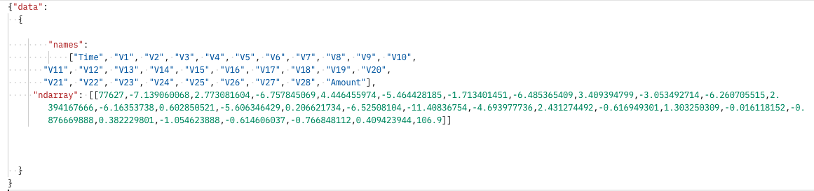
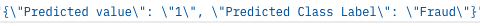

# Red Hat OpenShift Data Science Workshop - FSI Credit Fraud Detection

## Introduction

Welcome!

In this introductory workshop, you'll learn how to use **Red Hat OpenShift Data Science** or **Red Hat OpenShift Data Hub** to do Credit Fraud Detection.

* We'll start from a data like this:

The dataset used for this research is collected from Kaggle at https://www.kaggle.com/mlg-ulb/creditcardfraud. It consists of 284,807 transactions that occurred in 2 days, of which 492 are labelled as Fraud. This means that the dataset is highly unbalanced with only 0.172% accounting for the Fraud transactions. It consists of 31 features of which 28 (V1-V28) are the result of PCA transformation, due to confidentiality issues. Actual name of these features could be **credit card type, merchant category code, country code, currency**,  and etc. The remaining features that are not transformed are ‘Time’ and ‘Amount’, which represent the seconds elapsed between each transaction and the first transaction in the dataset and, the transaction amount respectively. The ‘Class’ feature represents the label of the transaction with ‘1’ for a Fraud transaction and ‘0’ for a ‘Genuine’ transaction.

[Andrea Dal Pozzolo, Olivier Caelen, Reid A. Johnson and Gianluca Bontempi. Calibrating Probability with Undersampling for Unbalanced Classification. In Symposium on Computational Intelligence and Data Mining (CIDM), IEEE, 2015]

* Then we'll automatically produce the semantic image segmentation results like this image:

And all of this without having to install anything on your own computer, thanks to **Red Hat OpenShift Data Science**\ **Red Hat OpenShift Data Hub**!

If you're ready,  [let's start!](step1.md)

## Navigation

<!-- startnav -->
* [Red Hat OpenShift Data Science Workshop - FSI Credit Fraud Detection](index.md)**<-- you are here**
* [Step 1: Starting a Jupyter environment](step1.md)
* [Step 2: The Jupyter environment](step2.md)
* [Step 3: Notebooks](step3.md)
* [Step 4: FSI Credit Fraud Detection](step4.md)
* [Conclusion](step8.md)
<!-- endnav -->
